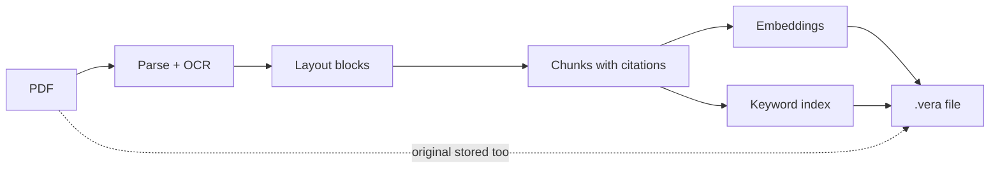
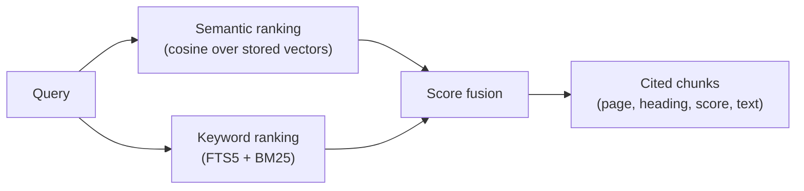

# VERA — Vector-Embedded Retrieval Archive

[](https://github.com/dkylewillis/vera/releases/latest)
[](https://pypi.org/project/vera/)
[](LICENSE)

A `.vera` file is a portable embedded vector database: one self-contained
SQLite file holding ready-made text chunks, pre-computed embeddings, a keyword
index, citation metadata, and the original source document. The file can be
copied, shared, or handed to an LLM agent and searched in place — no vector
database, embedding service, or retrieval server is required.

```bash
pip install "vera>=0.3.1"
vera convert manual.pdf manual.vera
vera convert notes.md notes.vera
vera search manual.vera "when is stormwater detention required?" --json
vera search ./archives "adding capacity" --where company=GRID --json
```

## The vision

Semantic search over a document normally requires a multi-stage pipeline —
parsing, chunking, embedding, and indexing — plus a running vector database to
hold the result. Every application that wants to search the same document
repeats that pipeline.

VERA moves the pipeline output into the file itself. A `.vera` archive stores
the parsed document together with its retrieval layer: chunks, embeddings, a
keyword index, and citation metadata. Conversion runs once; afterwards any
compatible application can open the archive and run semantic, keyword, or
hybrid search locally and offline, with results that reference the source
page and heading.

The primary use case is AI agents. An agent that receives a `.vera` file can
search it immediately — no parsing step, no chunking decisions, no embedding
API calls, and no vector database to provision.

## Getting started

Install the CLI (Python 3.10+). It bundles storage, the default PDF pipeline,
and offline OCR data:

```bash
python -m pip install "vera>=0.3.1"
```

### What 0.3 means

Release **0.3.x** is the software, CLI, and Python API version. The `.vera`
archive format remains **0.2**; existing archives are compatible. Package and
application versions do not change the on-disk format. See the
[changelog](CHANGELOG.md) for 0.3 behavior, including breaking unknown-provider
errors.

Convert a PDF and search it:

```bash
# Parse, OCR (if needed), chunk, embed, and index into one validated file
vera convert manual.pdf manual.vera

# Hybrid search (semantic + keyword) with page and heading citations
vera search manual.vera "stormwater detention requirements" --top-k 5

# Report pages, chunks, embedding model, parser, and metadata
vera inspect manual.vera

# Check integrity (exit code 0 = valid)
vera validate manual.vera

# Recover the embedded original PDF
vera export manual.vera exported.pdf

# List stored figures, or write their PNGs for an agent to attach
vera figures manual.vera --json
vera figures manual.vera --out-dir ./figures --json
```

The default embedding model is a deterministic local hashing embedder: no
model downloads, no API keys, and no network access. MiniLM neural embeddings
use Sentence Transformers:

```bash
python -m pip install "vera-doc[ml]"
vera convert manual.pdf --model sentence-transformers:all-MiniLM-L6-v2
```

Other Sentence Transformers Hub models also use `vera-doc[ml]`.

MiniLM can instead run on ONNX Runtime, which avoids the Torch dependency and
is how the desktop app ships it. That needs `vera-doc[onnx]` plus a
VERA-exported graph (the Windows installer vendors one):

```bash
python -m pip install "vera-doc[onnx]"
# export VERA_ONNX_MINILM_HOME=/path/to/minilm-parent
```

MiniLM prefers ONNX Runtime whenever a graph is available and falls back to
Sentence Transformers otherwise. Archive identity is
`sentence-transformers/all-MiniLM-L6-v2` under either runtime.

See the [getting started guide](docs/getting-started.md) for the full
walkthrough and [CLI recipes](docs/examples.md) for more patterns.

## CLI functionality

Every one-shot command accepts `--json` for machine-readable output, so the
full command surface is scriptable by agents and applications:

| Command | What it does |
|---------|--------------|
| `vera convert` | Convert a PDF, Markdown, Office/HTML (Docling extra), or a directory of sources into `.vera` archives |
| `vera search` | Hybrid, semantic, or keyword search over a file or a folder-as-corpus |
| `vera index` | Build, update, and check a persistent library index over many archives |
| `vera inspect` | Report pages, chunks, embedding model, parser, and archive metadata |
| `vera get` | Fetch one stored chunk by id as citation-ready JSON |
| `vera validate` | Verify schema, hashes, embeddings, and index integrity |
| `vera export` | Recover the original source document from the archive |
| `vera figures` | List stored figures, or write their image files to a directory |
| `vera eval` | Score retrieval quality against a query set (hit rate, MRR) |
| `vera ocr-languages` | List or fetch Tesseract OCR language data |
| `vera mcp` | Serve everything above to AI agents over MCP (stdio) |

Common compositions:

```bash
# Search a folder of .vera files as one corpus (results carry a "file" field)
vera search ./library "landscape buffer requirements" --top-k 5 --json

# Build a persistent, rebuildable index for large libraries
vera index build ./library --recursive
vera index update ./library

# Include neighboring chunks, figure metadata, or page-coordinate highlights
vera search manual.vera "pipe sizing chart" --json --context-chunks 1 --figures --regions

# Keyword mode for exact phrases and section numbers; semantic for paraphrases
vera search manual.vera "section 4.2" --mode keyword
vera search manual.vera "how big should the pond be" --mode semantic

# Reload a stored chunk by id (same citation fields as a search hit, no score)
vera get manual.vera chunk_0042 --json

# Batch-convert a nested PDF library, then measure retrieval quality
vera convert ./proposals --recursive --json
vera eval manual.vera queries.json --mode all --top-k 5 --json
```

Every search result includes citation fields:

```json
{
  "chunk_id": "chunk_0042",
  "score": 0.91,
  "text": "Detention is required when the proposed development increases...",
  "page_start": 117,
  "page_end": 118,
  "heading_path": "Chapter 4 > 4.2 Detention Design",
  "source_filename": "manual.pdf"
}
```

On a 1,038-page stormwater manual (2,442 chunks), hybrid search hits 9/10
real-world regulatory queries at MRR 0.900, tracked with
[`vera eval`](docs/evaluation.md).

## Agent integration

Three integration surfaces share the same retrieval engine:

- **CLI with `--json`** — any agent that can run shell commands can convert,
  search, inspect, get a chunk by id, and validate archives. This repository's own
  [AGENTS.md](AGENTS.md) teaches coding agents the workflow.
- **MCP server** — `vera mcp` exposes `vera_search`, `vera_corpus_search`,
  `vera_inspect`, `vera_validate`, `vera_figures`, `vera_get_figure`,
  `vera_get_page`, `vera_get_chunk`, and `vera_get_chunk_regions` as tools over
  stdio. Works with any MCP client; see [Connect an MCP client](docs/mcp.md).
- **Agent Skill** — a portable [SKILL.md](skills/vera/SKILL.md) package with a
  complete [CLI reference](skills/vera/references/cli-reference.md) that drops
  into Agent-Skills-compatible tools (Cursor and others). See
  [Install the VERA Agent Skill](docs/agent-skills.md).

The retrieval contract is the same everywhere: results always carry the source
filename, page range, and heading path, so an agent can construct a citation
such as *"(p. 117, Chapter 4 > 4.2 Detention Design)"* directly from result
fields. Optional `--regions` output adds page numbers and bounding boxes so a
viewer can highlight the exact source location of a result.

## How it works

**Conversion** runs the full ingestion pipeline once, in five steps:

1. **Parse.** The ingest pipeline extracts text and layout from every page,
   selectively OCRing image-based pages that have little or no native text.
2. **Structure.** Each page is decomposed into typed layout blocks — headings,
   paragraphs, tables, captions, and images — each with a page number and
   bounding box.
3. **Chunk.** Blocks are assembled into heading-aware chunks that keep their
   provenance: source filename, page range, heading path, and the regions
   they came from.
4. **Embed and index.** Every chunk gets one vector from the chosen embedding
   model and one row in the FTS5 keyword index.
5. **Package.** Chunks, embeddings, the keyword index, figures, page geometry,
   archive metadata, and the original PDF are written into a single SQLite
   file, validated, and published atomically.



**Search** repeats none of that work. A query runs both retrieval paths
against the local file and fuses them:

1. The query is embedded with the same model recorded in the archive and
   scored against the stored vectors by cosine similarity.
2. The same query runs through the FTS5 keyword index, ranked with BM25.
3. Both rankings are min-max normalized and combined with equal weight
   (`--mode semantic` or `--mode keyword` uses just one path).
4. The top chunks are returned with their score, text, source filename, page
   range, and heading path.



Both paths read the local SQLite file directly; no server process is
involved.

## Inside a `.vera` file

A `.vera` file is a plain SQLite 3 database with a standardized schema, fully
specified in [the format spec](docs/vera-spec-v0.2.md). You can open one with
any SQLite tool, though the CLI and Python API are the stable interface.

### What each table stores

| Table | Contents |
|-------|----------|
| `vera_metadata` | Format name/version, creator, embedding model, dimension, and normalization policy, plus a caller-owned `archive_metadata` JSON object (source filename and hash, parser identity, OCR diagnostics, page counts) |
| `chunks` | The only searchable unit: final chunk text plus `metadata_json` carrying `source_filename`, `page_start`/`page_end`, `heading_path`, and highlight `regions` |
| `embeddings` | Exactly one vector per chunk — little-endian float32, with the model name and dimension that produced it |
| `chunks_fts` | SQLite FTS5 full-text index over chunk text, ranked with BM25 |
| `attachments` | Opaque, SHA-256-hashed blobs: the original PDF, extracted figure images, and JSON viewer payloads for page and block geometry |
| `chunk_attachments` | Links chunks to attachments with a semantic `role` (`"source"`, `"figure"`) |

The archive records its own provenance: which parser, chunking strategy, and
embedding model were used, and whether stored vectors are L2-normalized.
`vera validate` checks schema, hashes, vector dimensions, and index
consistency against these claims.

### Blocks: how VERA understands document structure

During conversion, ingest pipelines decompose each page into normalized
**layout blocks**. Every block has a stable ID, a page number, a bounding box
in page points (origin top-left), and one of five types:

| `block_type` | What it is | How VERA uses it |
|--------------|------------|------------------|
| `heading` | Section titles, with detected heading level | Starts new chunks and builds the `heading_path` breadcrumb every citation carries |
| `paragraph` | Body text | The main content of chunks; its bbox becomes a highlight region |
| `table` | Detected tables, exported as markdown | Searchable as chunk text, so table contents show up in results |
| `caption` | Text adjacent to a figure | Joined to figures so search can return captioned figure metadata |
| `image` | Extracted figures, charts, and drawings | Stored as figure attachments with page and bbox — surfaced via `--figures`, never embedded as text |

Each chunk records the IDs of the blocks it was built from. That provenance
chain — chunk to blocks to page and bounding boxes — is what allows
`--regions` to return exact highlight rectangles for a search result, and
allows a viewer to draw a result's location on the source page. The full
mapping of blocks, figures, and regions onto the storage schema is documented
in [Figures and highlight regions](docs/figures-and-regions.md).

### Libraries of archives

A folder of `.vera` files is already a corpus — `vera search ./library ...`
searches them together and attributes each result to its file. For large
collections, `vera index build` creates a persistent `.vera-index/` beside the
archives. The index is derived and rebuildable: individual `.vera` files
remain the source of truth, and the index can be discarded and rebuilt at any
time. See [document libraries](docs/document-libraries.md) and the
[index structure](docs/library-index-structure.md).

## Plugins

The format does not depend on one parser or one embedding provider. Both are
pluggable through standard Python entry points.

### Ingest pipelines (`vera.ingest_pipelines`)

A pipeline is any callable `(source_path, IngestRequest) -> IngestResult` that
turns a source document into normalized pages, blocks, and chunks. Pipelines
are selected by `provider[:variant]` spec and configured with provider-owned
options:

```bash
vera convert manual.pdf --parser pymupdf --pipeline-option chunk_size=700
vera convert manual.pdf --parser docling:hybrid   # requires vera-ingest-docling
```

Two pipelines are currently available:

- **`pymupdf`** (default, via `vera-ingest-pymupdf`) — PyMuPDF + pdfplumber
  parsing, table extraction, heading detection, and selective Tesseract OCR
  with bundled English data. Installed automatically with the CLI and app.
- **`docling`** (optional, via `vera-ingest-docling`) — Docling layout models
  and HybridChunker for PDFs; search-only DOCX, PPTX, XLSX, and HTML.

A custom pipeline is registered with a decorator:

```python
from vera_ingest import register_ingest_pipeline

@register_ingest_pipeline("myformat")
def create_pipeline(variant: str = ""):
    def ingest(source_path, request):
        ...  # return an IngestResult with pages, blocks, and chunks
    return ingest
```

A pipeline distributed as a package with a `vera.ingest_pipelines` entry
point is discovered automatically by `vera convert --parser myformat`.
Pipelines can also publish descriptors that advertise their options for
schema-driven UIs. Official converters: PyMuPDF ships in the
packaged sidecar; Docling is the optional `vera[docling]` extra.
Extra plugins are pip packages in the same environment.
See [Creating an ingest pipeline](docs/creating-an-ingest-pipeline.md) and
[Creating an embedding provider](docs/creating-an-embedding-provider.md).

### Embedding providers (`vera.embedders`)

Embedding models are resolved from `provider:model-id` specs through the same
registry pattern:

```bash
vera convert manual.pdf --model hashing                                     # default: offline, deterministic
vera convert manual.pdf --model sentence-transformers:all-MiniLM-L6-v2     # local neural model
vera convert manual.pdf --model openai:text-embedding-3-small              # bundled hosted API; set OPENAI_API_KEY
vera convert manual.pdf --model hashing --embedder-option dimension=256    # provider-owned options
```

Built-in providers are `hashing` (deterministic lexical hashing; no extra
dependencies or network access) and `sentence-transformers` (MiniLM via the
`onnx` extra / ONNX Runtime in the Windows installer; other Hub models via
the `ml` extra). The installer vendors a VERA-exported `all-MiniLM-L6-v2`
graph; archive identity stays `sentence-transformers/all-MiniLM-L6-v2`.
OpenAI embeddings ship as the official `vera-embed-openai` plugin (bundled
with `vera` and the desktop sidecar). Archives converted with it are
**not portable for semantic search** — the recipient needs their own
`OPENAI_API_KEY`. Voyage and Ollama are not bundled. Third-party providers
register through the
`vera.embedders` entry-point group or `register_embedder()`, and can advertise
option schemas, model presets, and required credential environment variables
so hosts can preflight them without storing secrets in configuration. Unknown
model names are rejected with an error rather than silently substituted,
because the archive records exactly which model must embed queries at search
time. See
[Creating an embedding provider](docs/creating-an-embedding-provider.md).

## The packages

VERA is a mono-repo of independently installable packages with strict one-way
dependencies pointing at the storage engine:

```text
vera-ingest-pymupdf ──> vera-ingest ─┐
vera-ingest-docling ──> vera-ingest ─┤
vera-embed-openai ───────────────────┤
vera ────────────────────────────────┼──> vera-doc
vera-app ────────────────────────────┤
vera-mcp ────────────────────────────┘
```

| Package | Import / command | What it owns |
|---------|------------------|--------------|
| [`vera-doc`](https://pypi.org/project/vera-doc/) | `import vera_doc` | The core: `.vera` schema and validation, transactional chunk/attachment CRUD, embedding storage, and keyword/semantic/hybrid/corpus search. Has no knowledge of PDFs. |
| [`vera-ingest`](https://pypi.org/project/vera-ingest/) | `import vera_ingest` | Provider-neutral conversion: the pipeline registry, shared block/chunk types, chunking helpers, atomic archive writing, and viewer helpers for pages, figures, and regions |
| [`vera-ingest-pymupdf`](https://pypi.org/project/vera-ingest-pymupdf/) | plugin | Default PDF pipeline: PyMuPDF/pdfplumber parsing, table extraction, selective OCR |
| [`vera-ingest-docling`](https://pypi.org/project/vera-ingest-docling/) | plugin | Optional Docling pipeline with layout models and hybrid chunking |
| [`vera-embed-openai`](https://pypi.org/project/vera-embed-openai/) | plugin | Official OpenAI embeddings (stdlib HTTPS; bundled with CLI and desktop) |
| [`vera`](https://pypi.org/project/vera/) | `vera` / `import vera_cli` | The command line: argument parsing, text/JSON output contracts, exit codes, and retrieval evaluation |
| [`vera-mcp`](https://pypi.org/project/vera-mcp/) | `vera mcp` | Thin MCP adapter exposing search, inspection, figures, pages, and regions as agent tools |
| `vera-app` | — | Electron/React desktop application with a Python sidecar, built on the same packages |

The central boundary rule: `vera-doc` never imports extraction, UI, MCP, or
evaluation code. It is a general embedded vector database — attachments are
opaque bytes and metadata is caller-owned JSON — and every other package
composes around it. Details in
[CONTRIBUTING.md](CONTRIBUTING.md), [architecture](docs/architecture.md), and the
[package overview](packages/README.md).

**Who installs what**

- Agents and scripts → `vera` (optionally `vera[mcp]`)
- Apps with ready-made chunks → `vera-doc` only
- PDF conversion in your own app → `vera-doc` + `vera-ingest` + `vera-ingest-pymupdf`
- End users who want a GUI → the [desktop app](https://github.com/dkylewillis/vera/releases/latest)

## Use VERA as a Python library

Applications that already have chunks need only `vera-doc` — no PDF or ML
dependencies:

```python
from vera_doc import ChunkRecord, VeraDocument

with VeraDocument.create("knowledge.vera") as document:
    document.add([
        ChunkRecord(
            id="chunk-1",
            text="The minimum pipe diameter is 12 inches.",
            metadata={"source": "manual.pdf", "page": 42},
        )
    ])

with VeraDocument.open("knowledge.vera") as document:
    results = document.search(text="minimum pipe size", top_k=5)
```

PDF conversion is composed explicitly through `vera_ingest`:

```python
from vera_ingest import convert

convert("manual.pdf", "manual.vera")
```

See the [Python API guide](docs/python-api.md) for attachments, metadata
filters, corpus search, and embedding configuration.

## Design principles

1. **Run ingestion once.** The archive contains everything needed to search
   it; the ingestion pipeline does not run again after conversion.
2. **Preserve source truth.** The original document is stored inside the
   archive, and every result points back to its page, heading, and region.
3. **Be transparent.** The file declares its parser, chunking strategy,
   embedding model, and normalization policy, and `vera validate` verifies
   those declarations.
4. **Avoid lock-in.** SQLite container, documented schema, pluggable parsers
   and embedders — no dependence on any one vendor, model, or database.
5. **Be useful before it is perfect.** A working local search file is worth
   more than a perfect design that never ships.

## Desktop app

VERA also includes a desktop application. The packaged installer currently
targets Windows: PDF conversion from the Explorer context menu, library search
with highlighted citations, and an optional LLM provider connection for
grounded question answering over documents. The PDF viewer uses Mozilla-style
dark chrome with a page thumbnail rail, rotate counterclockwise, and citation
highlights that stay aligned on the source page. Ask answers render Markdown and
LaTeX. From a repository checkout,
`npm run app:dev` also runs on Linux and macOS. Configure chat providers and a Hugging Face token under
**File > Settings**. Packaged conversions use one sidecar with PyMuPDF.
**File > Open convert log...** opens
timed convert steps in `userData/logs/sidecar.log` (same file in
`app:dev` and packaged VERA). `app:dev` vendors MiniLM ONNX into
`packages/vera-app/build/minilm` before launch, so the app runs MiniLM on ONNX
Runtime and never loads Sentence Transformers. Packaged builds
vendor the same graph. Extra ingest and embedding plugins
are pip packages in that same environment. It is built on the
same packages described above. Download it from
[GitHub Releases](https://github.com/dkylewillis/vera/releases/latest) and see
the [desktop app guide](docs/desktop-app-getting-started.md).


The screenshot shows the three panes working together: the library of `.vera`
archives on the left, an answer with inline citations in the center, and the
source document on the right with the cited passage highlighted via stored
region coordinates.

## Documentation

Preview the documentation locally with `uv run --extra docs mkdocs serve`, or
browse the [published docs](https://dkylewillis.github.io/vera/).

- [Getting started (CLI)](docs/getting-started.md) · [CLI reference](docs/cli-reference.md) · [CLI recipes](docs/examples.md)
- [Convert documents](docs/conversion.md) · [Search documents](docs/searching.md) · [Document libraries](docs/document-libraries.md)
- [Figures and highlight regions](docs/figures-and-regions.md) · [Validation and export](docs/validation-and-export.md) · [Evaluation](docs/evaluation.md)
- [Python API](docs/python-api.md) · [MCP integration](docs/mcp.md) · [Agent skills](docs/agent-skills.md) · [Agent quick reference](AGENTS.md)
- [Creating an ingest pipeline](docs/creating-an-ingest-pipeline.md) · [Creating an embedding provider](docs/creating-an-embedding-provider.md)
- [Format spec 0.2 (current)](docs/vera-spec-v0.2.md) · [Format spec 0.1 (legacy)](docs/vera-spec-v0.1.md)
- [Architecture](docs/architecture.md) · [Contributing](CONTRIBUTING.md) · [Roadmap](ROADMAP.md) · [Changelog](CHANGELOG.md) · [Troubleshooting](docs/troubleshooting.md)

## Status and support

VERA is an experimental pre-1.0 project. Release **0.3.x** versions the
software, CLI, and Python API; the `.vera` archive format remains **0.2**.
Later format changes, if any, will be documented separately — see the
[roadmap](ROADMAP.md) and [changelog](CHANGELOG.md). The desktop installer
currently targets Windows and is available from
[GitHub Releases](https://github.com/dkylewillis/vera/releases).

VERA is licensed under [Apache-2.0](LICENSE).
