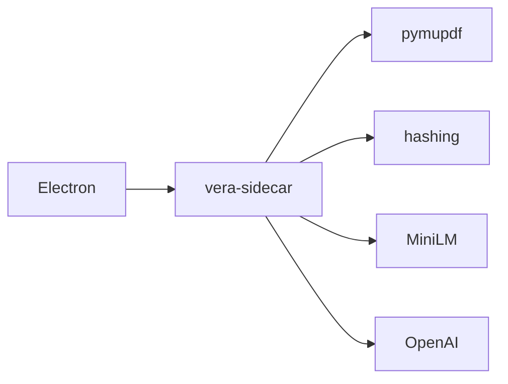

# VERA Desktop App Architecture

## Decision

`vera-app` is a desktop application, not a browser-served web app.

The app uses Electron with a React/TypeScript renderer for the desktop shell and a Python sidecar for document operations. The sidecar imports `vera-doc` directly and communicates with Electron over a JSON Lines protocol on stdio.

## Why Electron

Electron fits the product shape VERA is moving toward:

- local file and folder workflows
- PDF/document workspace UI
- sidebars, tabs, command palette, settings, and keyboard-driven interaction
- mature PDF.js and web rendering ecosystem
- a desktop packaging path (the current installer target is Windows;
  `npm run app:dev` works on Linux, macOS, and Windows)

Tauri remains a possible future optimization if app size becomes the dominant concern. PySide/PyQt would keep more code in Python but would make a polished document workstation UI more expensive to build.

## Package Boundaries

```text
packages/
  vera-doc/               # Python document engine (`vera_doc`)
  vera-ingest/            # conversion registry and archive writer
  vera-ingest-pymupdf/    # default PDF pipeline
  vera-ingest-docling/    # optional CLI Docling pipeline
  vera-embed-openai/      # official OpenAI embeddings plugin
  vera-cli/               # terminal interface
  vera-app/               # Electron desktop app plus Python sidecar
```

Dependency direction stays one-way:

```text
vera-cli -> vera-embed-openai -> vera-doc
vera-cli -> vera-ingest-pymupdf -> vera-ingest -> vera-doc
vera-app -> vera-embed-openai -> vera-doc
vera-app -> vera-ingest-pymupdf -> vera-ingest -> vera-doc
```

`vera-app` should not shell out to `vera-cli` for normal product behavior. The CLI is a user interface; the app backend should call `vera-doc` and ingest packages directly.

## Sidecar Protocol

The Electron main process starts:

```bash
python -m vera_app.sidecar
```

Requests and responses are newline-delimited JSON. Each request carries an `id` and an `action`; responses echo the `id` and return either `ok: true` with `result`, or `ok: false` with `error`. Packaged error responses omit Python `traceback` unless `VERA_APP_DEBUG` is set to a truthy value. Source-run prefers the workspace `.venv` interpreter, or `VERA_APP_PYTHON` when set. LLM `ProviderHttpError` responses also include `provider_error_detail` with the raw provider payload; the Chat **Trace** toggle surfaces that text as **Provider error details**.

Initial actions:

- `ping`
- `inspect`
- `validate`
- `search`
- `figure_data`
- `answer`
- `convert`
- `batch_convert`
- `export`
- `source`
- `page`
- `index_status`
- `index_build`
- `index_update`
- `list_models`
- `list_embedding_providers`
- `describe_embedding_providers`
- `list_embedding_models`
- `preflight_embedder`
- `list_ingest_pipelines`
- `describe_ingest_pipelines`
- `ocr_languages_list`
- `ocr_languages_download`
- `list_modes`
- `cancel`
- `skip`

`list_modes` and `answer` accept `modes_dir` (Electron `userData/modes`). User
`.md` files there override built-in Ask/Research/Summarize modes by `id`.
Ask's search tool applies a relative `quality` cutoff (`strict` 0.85,
`balanced` 0.55, `permissive` 0.0) against the top hit and skips already-cited
chunks; CLI/MCP search does not.

`cancel` and `skip` take `target_id` and signal the in-flight request's
cancellation token. `skip` is used by interactive batch convert; `cancel`
stops convert, search, inspect, source load, OCR download, and answers.

Sidecar JSON actions are an app-private protocol until they are versioned.
External tools should use the CLI, MCP, or Python APIs instead of speaking
this protocol directly.

This keeps the app UI independent from Python internals while preserving a simple local development loop.

## Convert in one sidecar

Electron talks only to the sidecar. Convert, batch convert, pipeline describe,
and embedder describe run in-process in that one interpreter.



The sidecar registers the default `pymupdf` pipeline, the bundled `markdown`
pipeline, and the bundled `openai`
embedder. Packaged Windows builds
freeze PyMuPDF, `onnxruntime`, `tokenizers`, and `vera-embed-openai` into one sidecar, and vendor a
VERA-exported `all-MiniLM-L6-v2` ONNX graph in the installer. Archive identity
stays `sentence-transformers/all-MiniLM-L6-v2`. Hugging Face tokens,
packaged `HF_HOME` (a writable cache under `userData` unless already set),
`VERA_ONNX_MINILM_HOME`, and `VERA_SENTENCE_TRANSFORMERS_HOME` (alias for the
bundled MiniLM snapshot) are forwarded on spawn. `app:dev` vendors
`packages/vera-app/build/minilm` before launch. `app:dev` leaves `HF_HOME` unset.
Convert stays on **Discovering files…** until `resolve_embedder` finishes.
Convert gates conversion on `preflight_embedder`.
Docling is a CLI extra (`vera-cli[docling]`) and is not listed in Convert.
The sidecar sets `PYTHONUNBUFFERED=1`
and forwards tqdm `\r` Hub progress as `[vera-sidecar]` lines. Electron tees
that stderr (plus a `sidecar_spawn` line with the executable and `isPackaged`)
into `userData/logs/sidecar.log`, rotated to
`sidecar.log.1` at about 2 MB. **File > Open convert log...**, Convert
**Open log**, and **Settings → Diagnostics** open that file. Search
reports `skipped_semantic_model_groups` when a query embedder is unavailable.
`list_embedding_models` and `credential_env` drive Convert presets and
**File > Settings → Embeddings**. OpenAI is bundled; Voyage and Ollama still
need a query-versus-document hint on `EmbeddingFunction` before they can ship.

## Active Libraries and Collection Indexes

Opening a workspace folder activates it as the default Search and Ask scope
without opening the corpus. Activation is instantaneous: it sets the active
library path, clears file-selection overrides, and refreshes the index badge
in the background. The corpus is opened on the first Search or Ask request.
Cached library summaries from an earlier Inspect are restored when
available. Selecting a library folder activates its Search/Ask scope and resets
the viewer to an empty document view; selecting an individual `.vera` scope
does not replace an open preview. Previewing an archive does not replace the
library scope. Checking one or more archives in Explorer
explicitly narrows retrieval to those files; clearing the checks restores
whole-library search. Chat sessions persist the scope path so reopening a
library-backed conversation restores its context.

The center workspace has **Chat** and **Search** modes. Chat keeps LLM-backed
conversations and their history, while Search runs direct hybrid, semantic, or
keyword retrieval without adding turns to a conversation. Both modes use the
same thread-and-composer layout. Search renders the query as a user message and
ranked passage results as selectable response cards; selecting a result opens
and highlights its source in the document viewer. Retrieval controls remain
available beneath the Search composer. Explorer, chat history, and conversion
remain sidebar views. Customize Chat behavior with Markdown files in
`userData/modes`; see [Customize Ask modes](desktop-app-getting-started.md#customize-ask-modes).

Figure-aware searches return metadata without image bytes. The renderer calls
`figure_data` only after selecting a result and caches the returned image data
by archive path and attachment ID. `vera_ingest.viewer.figures_for` queries the
result's linked figure attachment IDs directly; metadata queries omit the
attachment `data` column, and byte reads are limited to explicitly requested
IDs. Figure-enabled Ask modes use the same targeted reads for the bounded set
of images offered to a vision-capable model, then remove image data from stored
citations.

The app checks the folder's local collection index when the folder is added,
activated, refreshed, changed by the watcher, or receives a newly converted
archive:

- **Indexed** means the index is fresh and is used automatically.
- **Stale** means files changed after the last build.
- **No index** means no collection index has been built yet.

A fresh persistent index is used automatically for Search and Ask. The document
viewer's **Info** tab keeps **Inspect** available for an explicit validation
scan of a library and shows document inspection, validation, export, and page
text details beside the source they describe. Individual archive metadata is
inspected automatically when Document Info opens, so only Library Info exposes
the explicit **Inspect** action. Double-clicking a library opens a dedicated
**Library Info** state; single-clicking only changes the active Search/Ask
scope and leaves the viewer on its document view, empty when no document is
loaded. Library Info does not expose a Document tab or pass the directory to
the source-document loader, and its **Models**
field lists every embedding-model group represented in the library index. It
also shows document and chunk coverage, index freshness and reasons,
recursive/exclusion settings, skipped archives, storage usage,
generation/build/check timestamps, and per-model dimensions and counts. Its
close action clears the viewer in the same way as closing a document preview.
Libraries with at least 100
discovered archives prompt to build or update an unavailable index on Search or
Ask. Folder context menus expose **Convert…**, **Build index**, **Update
index**, rescan, show-in-system-folder, and close. **Convert…** opens
Convert in directory mode for that folder so pipeline, embedding, overwrite,
and nested-folder settings can be confirmed before converting. **Build index**
and **Update index** from that menu start immediately: the folder badge spins
and the footer reports progress.
The Search/Ask dialog (with **Search anyway** and **Don't ask again**) is only
for query-time prompts, not for an explicit menu action. File rows offer show-in-system-
folder (and preview/trash where applicable). File rows use ordinary list
selection: click selects one file, Ctrl/Cmd+click adds or removes it, Shift+click
selects the range from the last anchor, and the checkbox sets that row's membership
(check adds, uncheck removes). The row highlight and the Search/Ask selected-document
count follow that same list (a previewed document uses a
distinct marker, not the selected background). Selected `.vera` files become the Search/Ask scope; selected PDFs and Markdown files become
the Convert selection. Clicking a folder name clears the file selection and
returns Search/Ask to the whole library. Clicking empty Explorer space or pressing Escape
(while the sidebar has focus) clears file selection — PDF and Markdown picks, `.vera`
checkboxes, and a single-document scope (restoring the parent library when
possible) — and does not leave the last file looking selected. Clicking a `.vera` does not collapse
the folder or replace the document viewer. Double-click or right-click **View in document
viewer** / **Preview embedded source** loads that PDF, Markdown file, or archive original in
the source pane; right-clicking a PDF or Markdown file also offers **Convert file** /
**Convert files (N)** for the current selection (one or more files). Right-clicking a
`.vera` archive offers **Reconvert…**, which opens Convert immediately with a
preparing status (and footer activity) while the sibling source or embedded
original is resolved. Overwrite is enabled and the archive's current parser,
embedding, and OCR options are prefilled so they can be changed before replacing
the archive you clicked, even when that filename differs from the source file.
Reconvert skips exporting an embedded original when inspect fails
and no sibling source is listed (**Could not read archive metadata**). A second
Reconvert click is ignored until that preparation finishes. The same menus can be opened from the keyboard with
Shift+F10 or the Menu key, support arrow key navigation, and close with
Escape. Show-in-folder opens a library directory in the OS file manager, or
reveals a selected `.vera` / `.pdf` / `.md` file in its parent folder. Explorer restores
collapse from the last session as soon as folders appear: the active library stays expanded
and the rest stay collapsed, so every folder header remains visible without first
flashing every tree open. Restoring the saved library does not wait for other folders'
index-status checks; those badges still refresh in the background. Explorer keeps
the active-folder highlight without an Active text label, including when
selected files override the library, and represents index state with a compact
database badge: green for a fresh index and orange when an index is missing or
stale. A blue spinning badge means a build or update is running in the
background; after completion, a warning badge opens the report when archives
were skipped. Choosing **Search anyway** never blocks retrieval: the sidecar
performs recursive fan-out search and the app keeps a slower-search banner
visible. Watcher events and completed directory conversions update badges but
never start a build automatically. Explorer walks 32 directory levels below a
library root (`LIST_FOLDER_MAX_DEPTH`; the root itself is depth 0) and omits
deeper `.vera` / `.pdf` / `.md` files from the listing. The folder-listing payload
sets `truncated: true` when that cap is hit; Explorer currently does not display the flag.
Double-clicking a library folder activates
it and opens its Library Info view, clearing any document preview while leaving
the library available as the Search/Ask scope.

Any readable folder can remain active even before it contains a `.vera`
archive. Search and Ask open the corpus on demand; an empty library returns a
clear error instead of leaving the folder inactive. Other `VeraCorpus.open`
callers retain the strict non-empty default unless they pass `allow_empty`.

Explicit library inspection also runs on a sidecar worker. Request-scoped
`inspection_progress` events report completed/total archives, the current
archive, cumulative chunks, and skipped files through the shared task footer.
Inspection, conversion, indexing, and shorter renderer operations own separate
task ids, so one request settling cannot clear or strand another request's
status.

Interactive renderer actions also use an action scope. Starting a newer source
load, search, page load, validation, or similar action abandons any older
request in the same scope, removes its pending IPC entry, and cooperatively
cancels sidecar work when that handler supports cancellation. Newer tasks are
shown first in the footer. Interactive requests, including source loads, have
a five-minute watchdog; answers retain their explicit Stop control instead of
an automatic deadline. Sidecar exit, cancellation, timeout,
success, and failure all converge on the same task cleanup path.

Provider answer text is forwarded through request-scoped `answer_delta` events
as tokens arrive. A small sidecar filter holds partial `<tool_call>` and
`<functions.*>` markers until the provider response is parsed. Tool turns clear
any provisional prose with `answer_reset`; ordinary and final synthesis turns
remain incrementally visible without exposing inline tool syntax.

The optional LLM trace renders only explicit `search_start` and `search_done`
events as retrieval activity. Token-level `answer_delta` and `answer_reset`
events update the streamed answer but are omitted from the diagnostic trace.
Completed traces retain the real search events shown during generation.

Builds and updates run on a sidecar worker thread without using the app's global
busy state, so document browsing, Search, and Ask remain available. The folder
badge carries completion state instead of leaving a modal open. Request-scoped
`index_progress` events report discovery, completed/total archives, the current
archive, cumulative chunk and skipped counts, and final publication through the
shared background-task footer. Selecting a completed badge opens the latest
report, including indexed/chunk counts and invalid or embedding-incompatible
archives that were skipped. Index publication remains atomic in `vera-doc`, so
concurrent searches use the previous valid generation until the new generation
is published, and a failed build does not replace it. After a successful
publish, VERA deletes every other generation directory under
`.vera-index/generations/`.

## Batch conversion

The Convert view supports an Explorer selection of one or more PDFs or
Markdown files, or an entire directory. Opening the view (or switching
Individual files / Directory) prefills from the latest Explorer selection: a
non-empty file selection opens **Individual files**, and a folder or active
library seeds directory conversion.
**Individual files** also offers **Choose files** to browse for one or more
PDFs or Markdown files without using Explorer. Directory conversion can
include nested folders. Individual and directory modes
create each `.vera` archive beside its source file using the same base filename
(`proposal.pdf` becomes `proposal.vera`; `notes.md` becomes `notes.vera`).
Existing archives are validated
before they are skipped; malformed outputs are reported separately, and
overwrite must be selected explicitly. PDF conversion uses selective
PyMuPDF/Tesseract OCR (via `vera-ingest-pymupdf`) for image-based low-text
pages with English language data bundled into that package and the packaged
sidecar. Markdown uses the bundled `markdown` pipeline (no OCR). Docling remains a CLI extra (`vera-cli[docling]`), not a Convert
pipeline. It publishes a validated
temporary sibling atomically, preserves an existing destination after failure,
and rejects PDFs with no searchable text after OCR with an OCR-specific
message. Sidecar `convert` and `batch_convert` requests accept optional
`pipeline_options` and `embedder_options` plus legacy `chunk_size`, `overlap`,
`ocr_mode`, `ocr_language`, and `ocr_dpi` fields. Descriptor fields and OCR
engine determine which legacy ingest aliases are forwarded (Tesseract
`ocr_language`/`ocr_dpi`/`ocr_download` are not sent to Docling); explicit
`pipeline_options` win.
The Convert UI loads ingest descriptors through `describe_ingest_pipelines`
and renders them with `PipelineConfigForm` inside a collapsed
**Advanced pipeline options** section. Embedding providers are listed via
`list_embedding_providers`; `describe_embedding_providers` returns the same
Options-derived field metadata for schema-driven embedder controls.
`list_embedding_models` returns provider-advertised model presets, and
`preflight_embedder` checks credential env readiness without loading
runtimes. Secrets stay in the environment (`capabilities.credential_env`),
not in Options fields.
`batch_convert` also accepts an explicit `paths` list of
PDF files; when present, directory discovery is skipped. The sidecar continues
after per-file failures and returns converted, skipped, malformed, and failed
counts plus individual diagnostics. During multi-file conversion the UI shows
the current file path and offers **Skip** (continue with the next PDF) and
**Stop** (abort the batch). Workspace folders refresh after the batch, allowing
an existing collection index to become visibly stale without being rebuilt
automatically. Sidecar `convert` and `batch_convert` call `preflight_embedder`
before PDF work. CLI `vera convert` does not call `preflight_embedder`; it
resolves the embedder with `get_embedder`, matching `vera_ingest.convert()`.
The same public `vera-ingest` conversion path powers
`vera convert <directory> --recursive`, keeping desktop and CLI archive
writing aligned.

## Development Commands

From the repo root:

```bash
npm run app:install
npm run app:dev
npm run app:typecheck
npm run app:build
npm run app:dist
```

`npm run app:dev` starts Electron against the workspace sidecar with the
`app` extra (ONNX MiniLM) after vendoring `packages/vera-app/build/minilm`.
Convert uses PyMuPDF in that sidecar. `npm run app:dist`
packages the Python
sidecar through `packages/vera-app/scripts/build-sidecar.cjs`, which runs
PyInstaller with the project virtualenv when it is available (honoring
`VERA_SIDECAR_PYTHON` or `VERA_APP_PYTHON`) and otherwise falls back to
`uv run --extra app --extra sidecar --extra onnx`. Bundled Tesseract
English data is passed as an absolute path so the build works from any
directory. PyInstaller `--exclude-module` drops `torch` and
`sentence_transformers` so a freeze venv that also has the `ml` extra still
ships ONNX MiniLM only. The build copies `vera-ingest-pymupdf` and
`vera-embed-openai` package metadata. The sidecar registers the default
`pymupdf` pipeline and the `openai` embedder on import so Convert works in
frozen builds where `importlib.metadata` entry points are otherwise empty.
After a freeze, `node packages/vera-app/scripts/verify-packaged-sidecar.cjs`
asserts `describe_ingest_pipelines` reports `pymupdf` (and not Docling), that
`describe_embedding_providers` includes `openai`, that MiniLM
weights are present, and that Torch is absent.

From the repo root:

```bash
uv run --extra dev python -m pytest -q
```

## Source Document Viewer

The `source` sidecar action accepts either a `.vera` archive or a filesystem
`.pdf`. Archives materialize the embedded source attachment; PDF paths are
copied into the same hash-keyed cache under Electron's userData
`source-cache/` directory. Both return metadata plus `cache_path`. Electron
rewrites that path to a privileged `vera-source://cache/...` URL and serves
the bytes with `protocol.handle`, so PDF.js can fetch the document without
shipping multi‑MB base64 through the JSON-Lines IPC channel (which previously
froze the UI on large PDFs).

The renderer PDF viewer (PDF.js) defaults to fit-width zoom so pages fill the
source pane without horizontal cropping. Clicking **Width** calculates the
scale from the currently active page; that scale remains stable while scrolling
through documents with mixed page sizes or orientations until the user clicks
**Width** again. Pages that fit the viewport are horizontally centered, while
oversized pages align to the left so their full width remains scrollable.
The Width control is highlighted only when the currently active page is
actually fit to the available width, so moving to a differently sized page
clears the highlight until that page is refit.
Resizing the pane refits the page that established the current fit-width scale.
Fit-page accounts for both the widest and tallest pages. The
viewer also supports page navigation (previous/next and an editable page field),
discrete zoom steps with Ctrl/Cmd+wheel and standard zoom hotkeys, and
viewport-preserving zoom so the visible page stays put when scale changes.
Manual zoom is temporary: resizing the source pane (or window) snaps back to
fit-width, while an explicit fit-page choice continues to reflow on resize.
Pages render at device pixel ratio for sharper output on HiDPI displays.
Citation passage and figure highlights can be
toggled, with a compact color legend when both are present. The viewer header
promotes the document basename (with the full path in a tooltip) instead of a
static "Document Viewer" label, shows page range as a secondary line in chunk
mode, and shortens mode tabs to View / Info below about 500px so the title
stays readable in a narrow pane. The viewer chrome
can hide the pane (keeping a right-edge toggle) or expand it by hiding chat so
the document fills from the left sidebar to the window edge. Closing the open
document clears its preview, selection, and highlights while leaving the viewer
pane, active library, and Search/Ask scope intact. When the displayed source
was extracted from a `.vera` archive, the viewer's **Info** tab
that inspects that archive and shows its format, source, page and chunk counts,
embedding model and dimensions, creation time, archive size, parser and
chunking settings, OCR summary, attachment count, validation status, and
export controls alongside the PDF.

## Near-Term App Work

- Voyage and Ollama embeddings after an optional query/document hint on
  `EmbeddingFunction`.
- Add recent document shortcuts.
